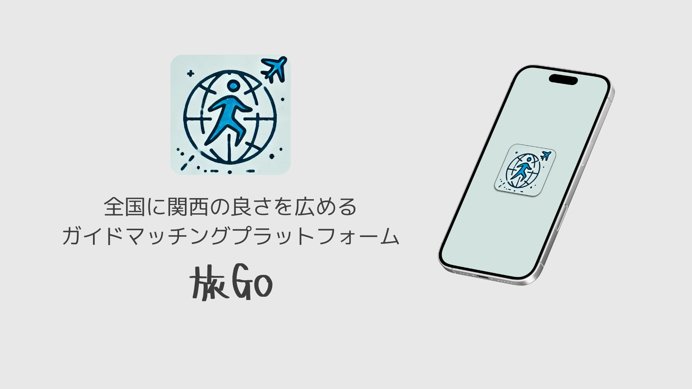

旅Go
======================

## 概要

関西を訪れる大学生と関西に住む純関西人をリアルタイムでマッチングし，現地のリアルな魅力を体験できるアプリです．関西には独自文化やユニークな魅力があり，多くの人が旅行で訪れますが，観光地巡りだけでその土地の「本当の良さ」を知ることが難しいです．特に大学生の旅行はネット情報に頼りがちで，地元の人交流が少なく，表面的な観光に終わってしまう事が多いです．一方で，関西に住む人々は，自分たちの地域の良さを伝えたいと考えているものの，その機会が少なく，発信する場も限られていると考えました．そこで，このギャップを埋めることで，「関西をいい感じに」体験し，旅行者と地元の人双方にとって価値のある仕組みを作りたいと考えました．2025/2/15-24に行われた「KC3Hack 2025」の成果物になります．

### マッチング機能の実装
React Native × Firebase で開発しました．認証はFirebase Authentication，位置情報追跡はFirebase Realtime Databaseを使用しました．
#### 旅行者側
1. 各ガイドのガイド可能エリアが示されたマップが表示される
2. ガイドリクエストを送る
3. ガイドから承認されると，チャットが可能になる
4. マッチングが終わると，ガイドをレビューして終了

#### ガイド側
1. ガイド可能エリアを設定  
（realtime database によりガイド可能エリアの情報がリアルタイムに更新）
2. ガイドモードをOnにする

## デモ
#### 旅行者側
https://github.com/user-attachments/assets/285a801e-7420-4389-b2d7-d887c848f733

#### ガイド側
https://github.com/user-attachments/assets/88f13263-a5cf-4427-8b22-5de5d38df877

